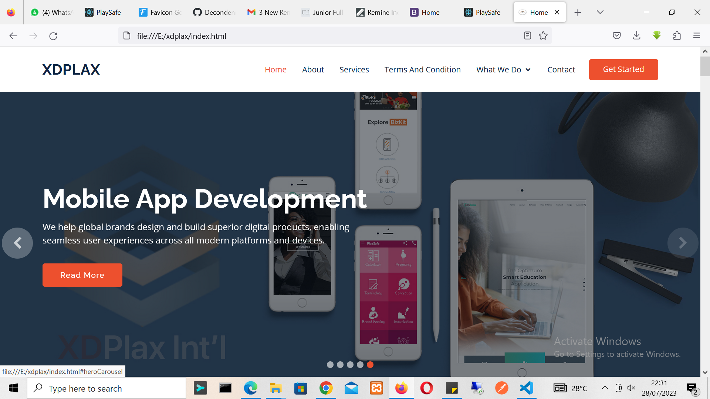
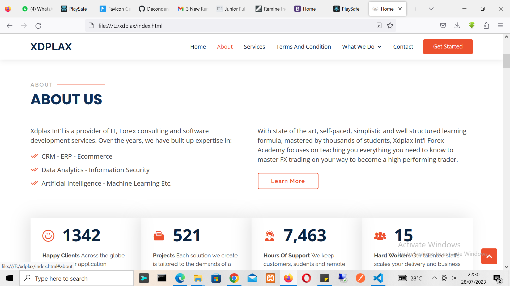
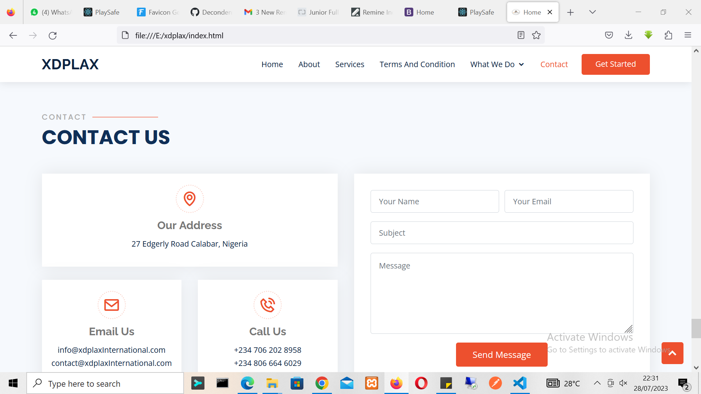
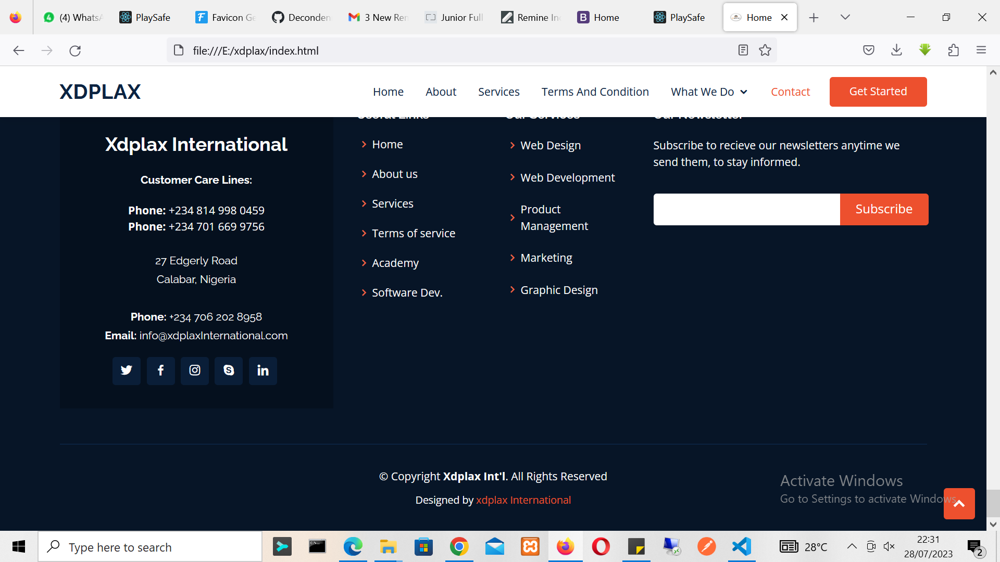

## Xdplax Official Website: Empowering IT, Forex, and Software Solutions

Xdplax is an international company offering a range of services, including IT consulting, Forex expertise, and software development. Our website, www.XDPLAXX.com, serves as a hub for individuals and businesses seeking cutting-edge solutions and comprehensive learning opportunities.

## Technology Stack Used:
Our website, www.XDPLAXX.com, has been built using a robust and modern technology stack to ensure optimal performance and user experience. The technology stack includes:

   ## HTML: 
   The foundation of our website's structure, providing the essential elements for content presentation.
   ## CSS: 
   Used for styling, enabling us to create an aesthetically pleasing and responsive design for different devices and screen sizes.
   ## Bootstrap: 
   Employed for a consistent and mobile-friendly layout, ensuring seamless navigation across platforms.
   ## JavaScript:
   Adding interactivity and enhancing the user experience with dynamic elements.
    Google Fonts: Utilized to offer a diverse range of fonts, enhancing the website's typography.
    Vendor CSS Files: We integrated various vendor CSS files to leverage pre-built styles and icons, ensuring a visually appealing interface.
    Template Main CSS File: Our custom CSS file tailored to the specific design and branding needs of XDPLAX.com.

## Features and Content:
Upon visiting www.XDPLAXX.com, visitors are greeted with a sleek and user-friendly interface. The navigation menu provides easy access to essential sections, such as Home, About, Services, Terms and Conditions, and Contact. Additionally, our What We Do section encompasses Forex Academy and Software Development, showcasing our expertise in these domains.

## Forex Academy:
At Xdplax Int'l Forex Academy, we offer state-of-the-art and self-paced learning programs, tailored to help individuals master FX trading and become high-performing traders. With a well-structured curriculum, thousands of students have already benefited from our comprehensive learning formula.

## Commitment to Sustainability:
As a responsible global entity, we prioritize sustainability in our business practices. At XDPLAX, we uphold human rights, respect the environment, and constantly strive for sustainable development. Our corporate website and marketing materials actively promote sustainable IT and Forex business practices worldwide.

We, at www.XDPLAXX.com, are dedicated to providing top-notch IT, Forex, and software solutions.

